# AWS_log

## 기상대(AWS) 데이터 수집

-----------------
- aws_csv.py -> 기상대에서 환경데이터 업데이트 후 csv 파일로 저장  
- thingspeak_log.py -> 기상대 데이터 thingspeak로 전송   
 

- show_graph.py -> 기상대 데이터 , thingspeak 데이터 그래프
### 강우는 누적을 했어야..하는 부분 -> 추후 수정 필요 

### 일주일간 thingspeak에 로깅된 데이터로 그린 일별 평균 그래프 
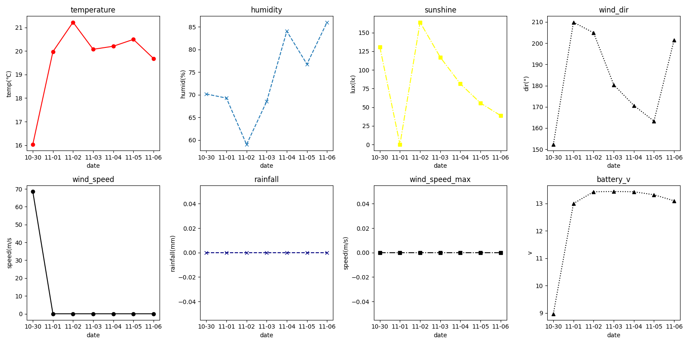
*11월 5일 비가 왔는데 강우가 0인 이유 

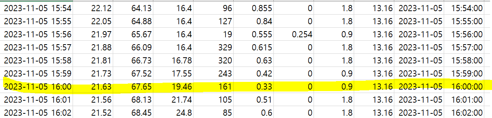

thingspeak_log.py에서는 정시마다 기상대 데이터를 전송 
정시에 강우가 0인경우가 있었음

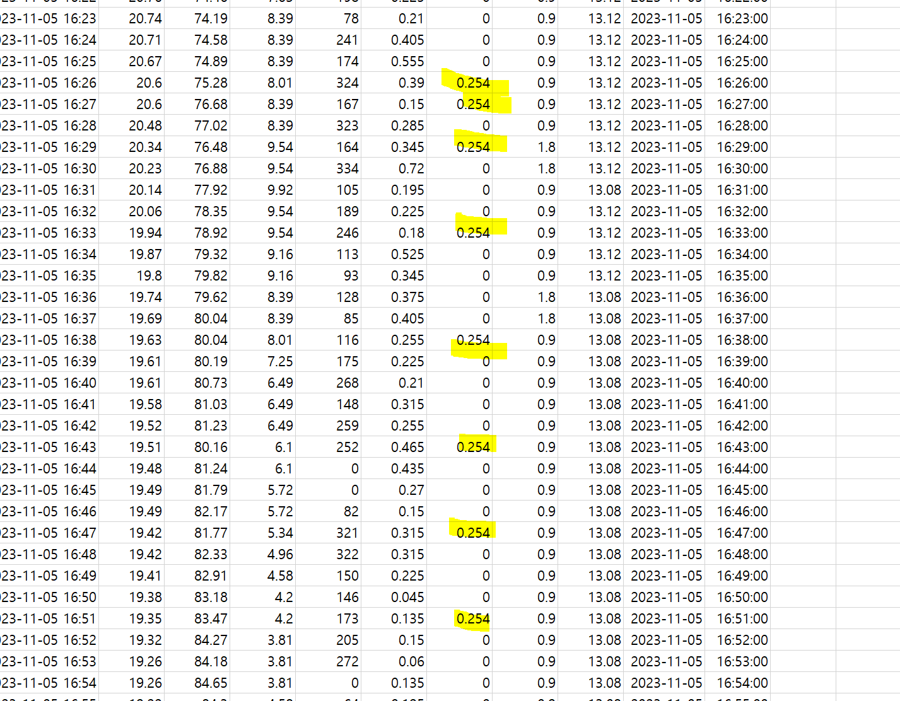

비가 계속 내렸음에도 불구하고 강우 값이 같은 값으로 끊겨서 들어옴

-> 기상대 센서확인 필요 

--------------------------------------

### 시간대별 환경 데이터 평균 그래프 (전체 vs 일주일)
- 기상대에서 받아온 데이터 전체와 최근 일주일 데이터 비교
- 일자별로 정시 정각에 데이터만 모아서 평균을 낸 것 

** thingspeak 23 ~ 1시 사이에 값이 안들어옴...

- 파란색 : 전체 , 빨간색 : 일주일  

- 온도 
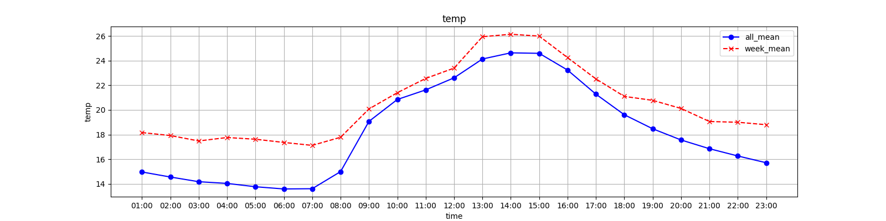

- 습도
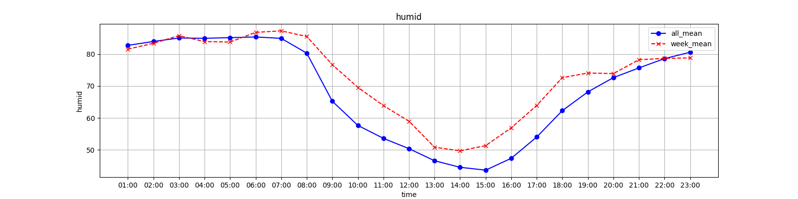

- 일사
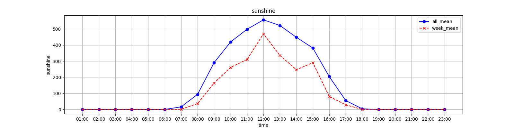

- 풍향
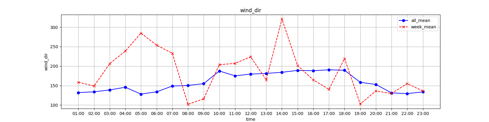

- 풍속
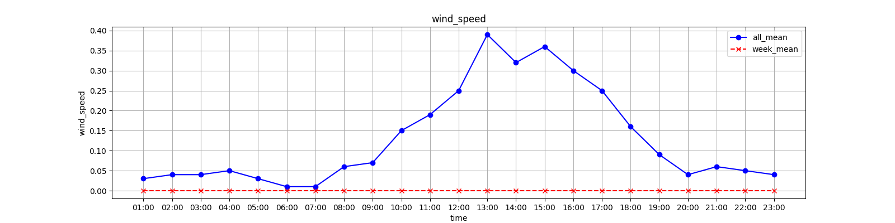

- 최대순간풍속
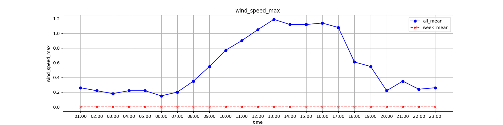

- 강우
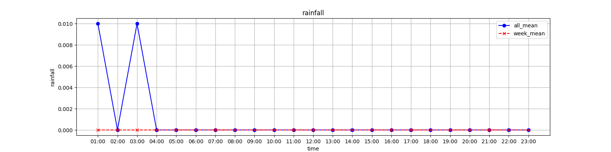

- 배터리전압
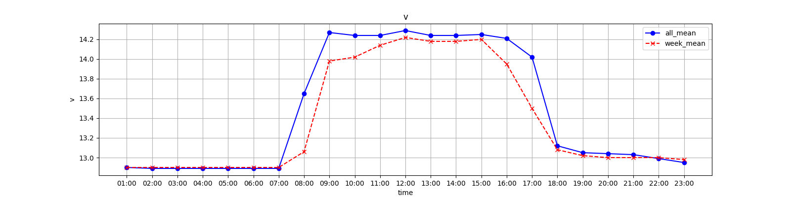

- 풍속, 최대순간풍속, 강우는 값이 끊겨서 들어오는 경우가 많았음  
- 그래프를 그릴때 scatter로 그리는 것이 좋을 듯 
